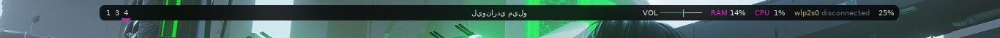
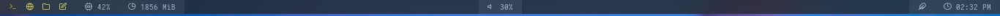

<!-- PROJECT LOGO -->
<br />
<div align="center">
  <p align="center">
    Modules for Polybar
    <br />
    <a href="https://github.com/midnightxd/Modules"><strong>Explore the docs »</strong></a>
    <br />
    <br />
    <a href="https://github.com/midnightxd/Modules">View Demo</a>
    ·
    <a href="https://github.com/midnightxd/Modules/issues">Report Bug</a>
    ·
    <a href="https://github.com/midnightxd/Modules/issues">Request Feature</a>
  </p>
</div>

## About The Project






<p align="right">(<a href="#top">back to top</a>)</p>


<!-- GETTING STARTED -->
## Getting Started

### Prerequisites

* Polybar
  ```sh
  #xbps-install -S polybar 
  ```

### Installation

The following steps describe the installation in the following distributions: Void Linux and Systems based on Debian or Ubuntu

1. Clone the repo
   ```sh
   git clone https://github.com/your_username_/Project-Name.git
   ```
2. Select your module
   ```sh
   Example Data: copy the code of module from your polibar setting
   ```
<p align="right">(<a href="#top">back to top</a>)</p>


<!-- USAGE EXAMPLES -->
## Usage
Syntax in your file Polybar config:<br> module-left = YOUR MODULE<br>
module-center = YOUR MODULE<br>
module-right = YOUR MODULE


_For more examples, please refer to the [Documentation](https://github.com/polybar/polybar)_

<p align="right">(<a href="#top">back to top</a>)</p>

